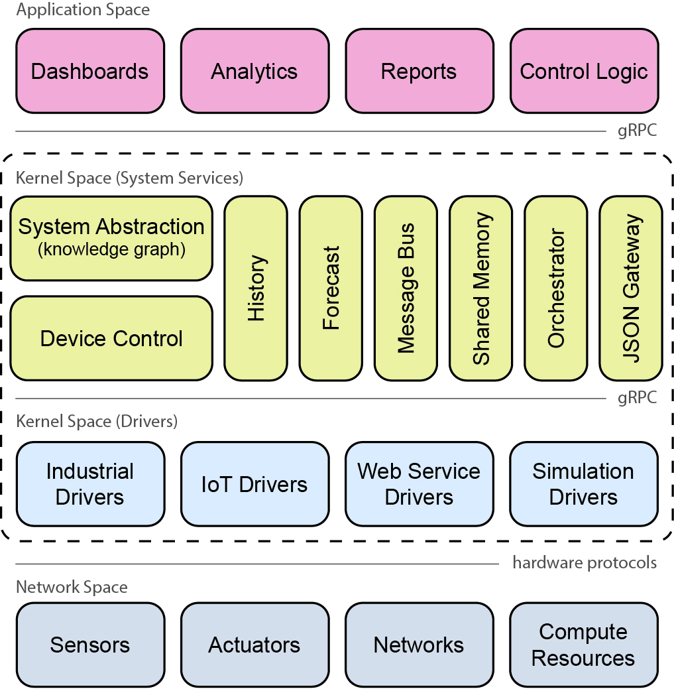

# Architecture Overview

BOS is organized into four layers that communicate via gRPC (internal services) and hardware protocols (drivers to devices).

---

## Network Space

Physical and virtual infrastructure that BOS connects to: sensors, actuators, field networks (BACnet, Modbus, etc.), and compute resources (controllers and servers).

---

## Kernel Space — Drivers

Drivers translate hardware protocols into a uniform gRPC interface consumed by Device Control. BOS ships drivers for:

- **Industrial** — BACnet, Modbus
- **IoT** — Particle, Terabee, Kasa
- **Web Service** — REST/HTTP-based integrations
- **Simulation** — BOPTest and synthetic data sources for testing

Each driver exposes a small gRPC service; Device Control resolves a point URI to the correct driver at runtime using xref mappings stored in the system model.

---

## Kernel Space — System Services

The core services that applications build on. All are reachable over gRPC.

| Service | Role |
|---------|------|
| **System Abstraction** (Sysmod) | RDF knowledge graph of devices, points, and spaces with semantic typing (Brick ontology) |
| **Device Control** | Protocol-agnostic read/write gateway; resolves point URIs → xrefs → driver calls |
| **History** | Time-series historian; configurable per-point sample rates |
| **Forecast** | Stores and retrieves model-generated point forecasts |
| **Message Bus** (EventBus) | Kafka-backed pub/sub bus for events, alarms, and telemetry |
| **Shared Memory** | Redis-backed key-value store for inter-app data exchange |
| **Orchestrator** (Scheduler) | Runs, schedules (cron), and event-triggers containerized apps |
| **JSON Gateway** | HTTP/REST façade over the gRPC services for external integrations |

---

## Application Space

Apps run as containers and interact with the kernel services via gRPC (directly or through the `bospy` Python library). Common app patterns include:

- **Dashboards** — real-time visualization of sensor data and system state
- **Analytics** — fault detection, occupancy inference, energy analysis
- **Reports** — scheduled summaries and data exports
- **Control Logic** — setpoint adjustment, demand response, supervisory control loops
